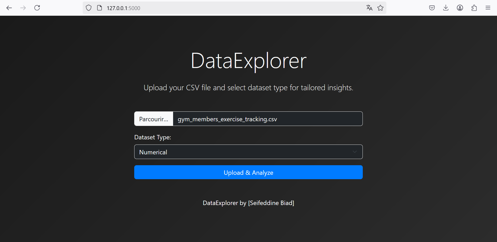
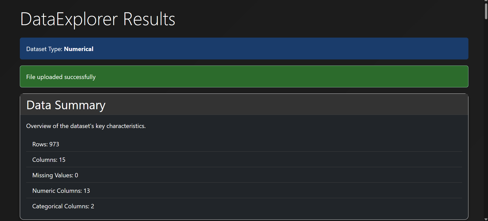
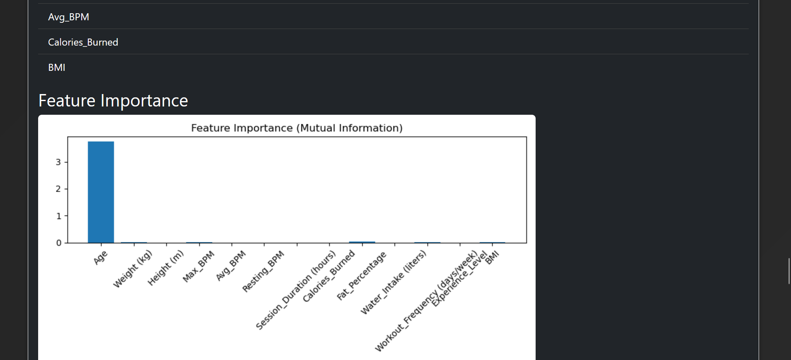

# **DataExplorer: Advanced Exploratory Data Analysis Web Tool**  

**DataExplorer** is a powerful, user-friendly web application designed for in-depth **exploratory data analysis (EDA)**. Built with **Flask**, it enables users to upload CSV datasets, analyze them using advanced statistical tools, and generate detailed **PDF reports**—all within a sleek, modern interface.  

## **Key Features**  

- **Flexible Dataset Support**: Handles **numerical** and **NLP/text** datasets with tailored EDA pipelines.  
- **Comprehensive Analysis**: A **seven-step** process that includes:  
  - Data loading  
  - Statistical exploration (Shapiro-Wilk, Pearson correlation, Chi-Square, etc.)  
  - Handling missing values  
  - Outlier detection & removal  
  - Data normalization (Min-Max, Z-Score, Log)  
  - Feature selection  
  - Visualizations  
- **Interactive Preprocessing**: Advanced options for handling missing values and outliers with real-time feedback.  
- **Visual Insights**: Generates **boxplots, histograms, word clouds,** and **feature importance charts**.  
- **Exportable Reports**: Generate and download **detailed PDF reports** summarizing all EDA steps.  
- **Modern UX**: Responsive design with **loading spinners, success/error messages, and scrollable tables** for large datasets.  

## Screenshots 








## **Tech Stack**  

- **Backend**: Python, Flask, Pandas, NumPy, SciPy, Scikit-learn  
- **Frontend**: Bootstrap 5, HTML, CSS, JavaScript  
- **Data Processing**: Pandas, NumPy, SciPy  
- **Visualization**: Matplotlib, Seaborn, WordCloud  
- **PDF Generation**: ReportLab  

## **Getting Started**  

1. Clone the repository:  
   ```bash
   git clone https://github.com/Seifeddine-bd/DataExplorer.git  
   cd DataExplorer
   ```  
2. Set up a virtual environment (recommended):  
   ```bash
   python -m venv venv  
   source venv/bin/activate  # Windows: venv\Scripts\activate  
   ```  
3. Install dependencies:  
   ```bash
   pip install -r requirements.txt  
   ```  
4. Run the application:  
   ```bash
   flask run  
   ```  
5. Open **http://127.0.0.1:5000/** in your browser to start analyzing your data!  

## **Credits**  

- **Created by**: [Seifeddine-bd](https://github.com/Seifeddine-bd)  
- **License**: [MIT License](LICENSE)  

## **Contributions**  

We welcome contributions! 🚀 
Feel free to **fork the repo**, submit **pull requests (PRs)**, or open **issues**.  
